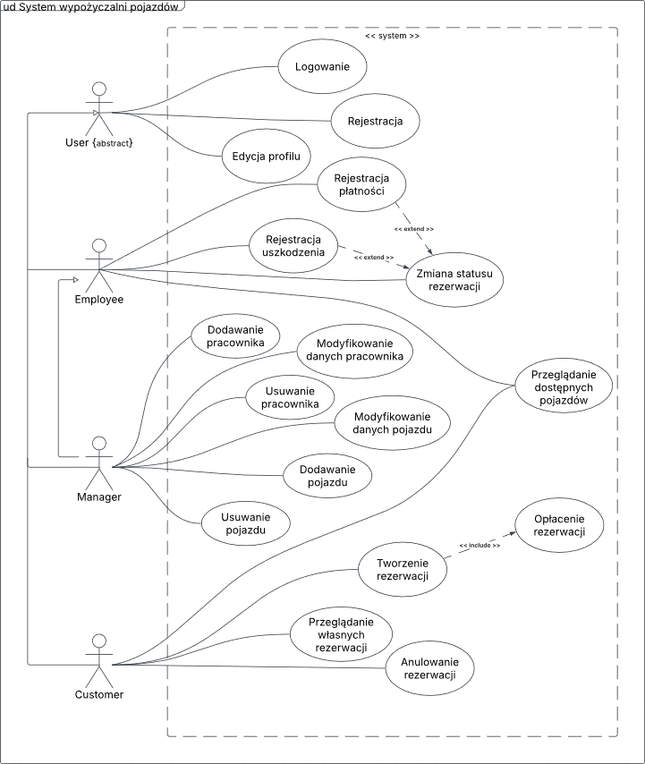
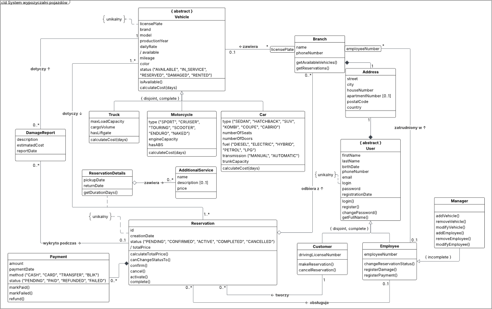
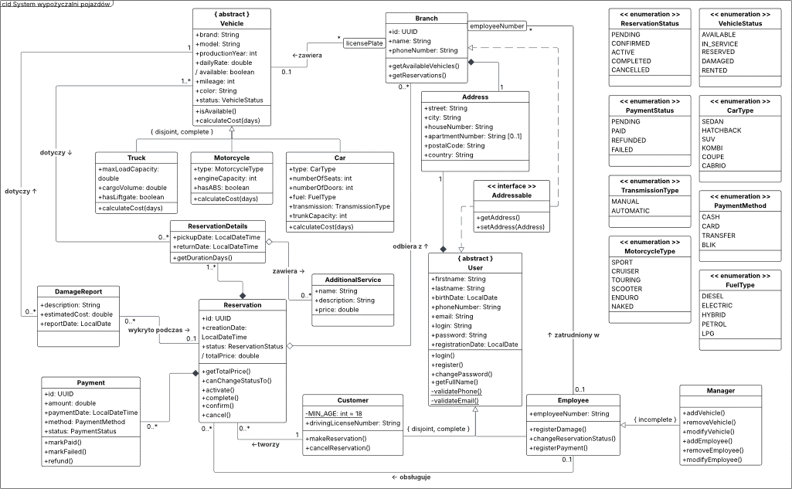
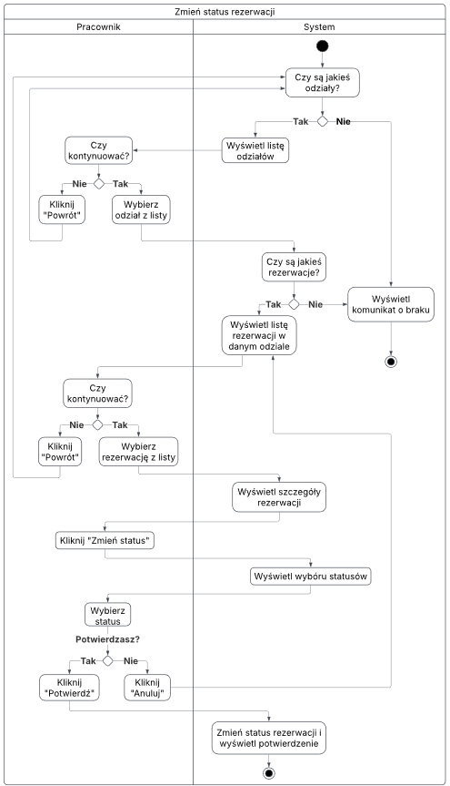
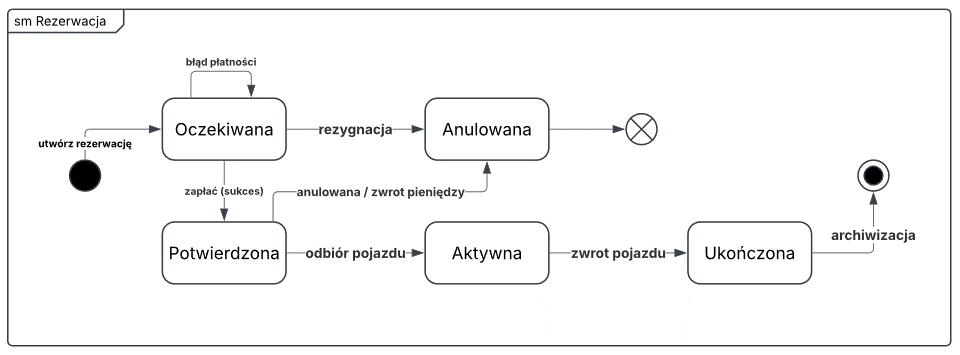
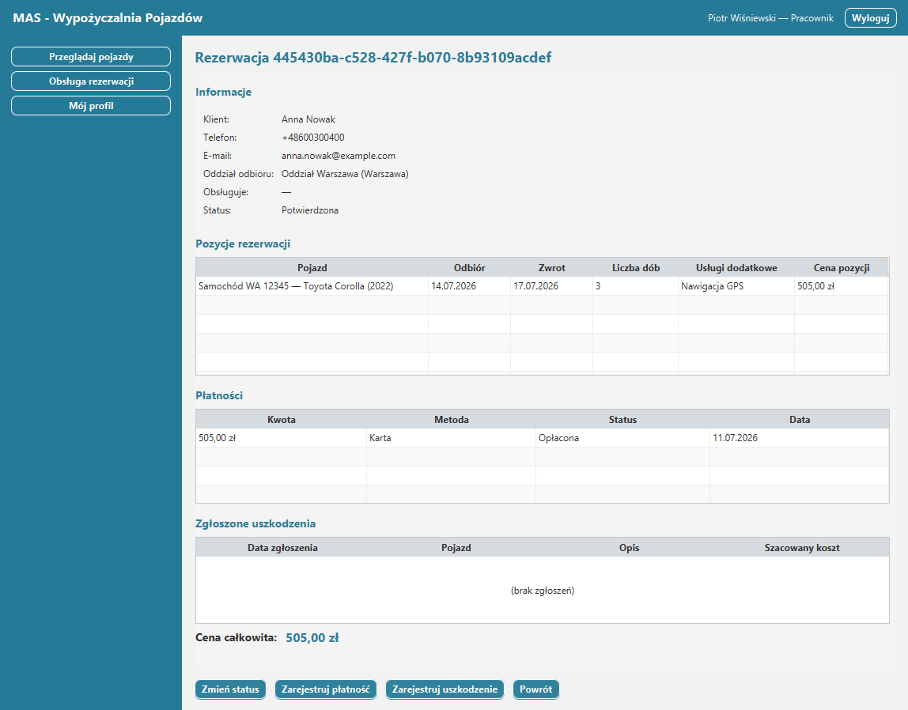

# Vehicle Rental System - MAS Project

This is my final project in the Modeling and Analysis of Information Systems (MAS) subject as part of the PJATK studies.

> Desktop application (Java + JavaFX) for multi-branch vehicle rental, with data 
> persistence based on on serializing objects.

---

## Table of contents

1. [User Requirements](#1-User-Requirements)
2. [Non-functional requirements](#2-Non-functional-requirements)
3. [Use Case Diagram](#3-Use-Case-Diagram)
4. [Analytic Diagram](#4-Analytic-Diagram)
5. [Design Diagram](#5-Design-Diagram)
6. [Use Case Scenario](#6-Use-Case-Scenario)
7. [Activity Diagram for Use Case](#7-activity-diagram-for-use-case)
8. [Class-State-Diagram](#8-Class-State-Diagram)
9. [GUI Design](#9-GUI-Design)
10. [Effects of dynamic analysis](#10-Effects-of-dynamic-analysis)
11. [Overview of design decisions](#11-Overview-of-design-decisions)

---

## 1. User requirements

1. The system is used by customers and employees. The same user cannot be a customer and an employee at the same time. The roles are separable, and each user has exactly one of them. An employee can be a manager, i.e. an employee with extended privileges, who performs all the activities of an employee.
2. Each user logs in with a unique login and password. The system authenticates the user and provides features appropriate to their role.
3. For each user, the following are stored: name, surname, date of birth, telephone number, e-mail address and residential address. The date of registration of the account is also remembered. Each logged-in user can view and edit their own account data (phone number, e-mail address, home address) and change their password after entering the current one.
4. The address includes street, house number, optional apartment number, zip code, city and country. The address is stored for both the user and the branch.
5. The client has a driver's license number and must be of legal age (at least 18 years old). The customer can register an account on their own, view available vehicles, make and cancel their own reservations, and view their history.
6. The employee has an employee number. The employee handles reservations, changes their status, records payments and records vehicle damages detected during service. The manager additionally adds, removes and modifies vehicles and hires, dismisses and modifies employee data.
7. The system covers multiple branches. Each branch has a name, phone number, and address. The branch operates a fleet of vehicles, where each vehicle is identified in the branch by its registration number, and employs staff in which the employee is identified by the employee number. Each vehicle belongs to one branch.
8. The system stores a vehicle catalogue. Each vehicle is exactly one type: a car, a truck or a motorcycle. For each vehicle, the following are remembered: unique registration number, make, model, year of manufacture, daily rate, mileage, color and status.
   - **Car:** body type, number of seats, number of doors, fuel type, gearbox type, trunk capacity.
   - **Truck:** load capacity, cargo space volume, presence of a loading elevator.
   - **Motorcycle:** type, engine capacity, presence of ABS system.
9. A vehicle can have one of the following statuses: available, reserved, rented, serviced, damaged. Only a vehicle with the status of *available* can be booked. The cost of rental is calculated on the basis of the daily rate and the characteristics of a given type of vehicle.
10. The reservation includes at least one vehicle. For reservations, the following are remembered: unique identifier, date of creation, status and calculated total price. Each booking item is vehicle-specific and includes the pick-up date and the planned return date. The reservation is collected at the indicated branch, associated with the customer who made it and, once serviced, with the employee who handles it.
11. A reservation is subject to a controlled status cycle: pending → confirmed → active → completed, with the possibility of canceling a pending or confirmed reservation. The system only allows passages that comply with this cycle.
12. The system controls the availability of vehicles based on their status. Once the reservation is confirmed, the vehicle becomes booked, rented at the time of release, and returns to the available status after return or cancellation. A vehicle that is unavailable cannot be rebooked.
13. Additional services (e.g. GPS navigation, car seat, insurance) can be attached to each booking item. The service has a name, an optional description and a price added to the value of the reservation.
14. The system stores payment information. The payment has an amount, date, method (cash, card, transfer, BLIK) and status (pending, paid, returned, failed). The payment can be registered by the customer when making a reservation or by an employee when handling it. Registering a paid payment for the full amount confirms the reservation, and canceling the reservation allows for a refund.
15. When handling a reservation, an employee may register damage to the vehicle. The damage report remembers the description, the estimated cost of the repair and the date of the report; is linked to the specific vehicle and to the booking during which the damage was detected. A damaged vehicle is given the status of damaged.
16. It is not possible to delete a vehicle associated with an active booking.

**The system should enable the implementation of the following functionalities:**

- viewing available vehicles (client, employee),
- account registration (client),
- logging in and authentication (client, employee),
- editing your own account data and changing your password (customer, employee),
- making a reservation with a selection of additional services and payment (client),
- cancellation of their own reservation (client),
- viewing your own reservations and history (client),
- change of reservation status (employee),
- recording payments (employee),
- recording damage to the vehicle (employee),
- adding a vehicle (manager),
- removal of the vehicle (manager),
- modifying vehicle data (manager),
- hiring an employee (manager),
- dismissing an employee (manager),
- modifying the employee's data (manager).

---

## 2. Non-functional requirements

- Access to the function requires login, and the scope of permissions results from the user's role; The disconnection of the customer and employee roles is enforced by the structure of the model.
- The system verifies the correctness of the data (m.in. the format of the e-mail address and phone number, the customer's age, the correctness and order of the booking dates) and the uniqueness of the login and registration number of the vehicle within the system, and the employee number – within the branch.
- The data is persisted in a way that allows it to be read when the application is restarted; Serialization of objects to a file is applied, without a relational database.
- The app has a simple, intuitive interface with navigation tailored to the user's role.
- Layered architecture (model – application logic – interface) and hierarchies of vehicle and user classes allow you to add new types of vehicles, roles or functions without rebuilding the basic structure.
- The application works independently of the platform, and the booking status machine ensures that the system is always in the correct, predictable state.

---

## 3. Use case diagram

---

## 4. Analytic Diagram

---

## 5. Design diagram

---

## 6. Use case scenario

**Use Case:** Change Booking Status
**Actor:** Employee
**Prerequisite:** The employee is logged in to the system and has the authority to change the status of the reservation.

### Main Flow

1. The system checks if there are any branches in the system.
2. The system displays a list of branches.
3. The actor chooses one branch from the list.
4. The system checks whether there are reservations for the selected branch.
5. The system displays a list of reservations related to the selected branch.
6. The actor marks the selected reservation from the list.
7. The system displays detailed information about the reservation (customer data, reservation items with vehicles, dates, payments and current status).
8. The actor clicks the "Change Status" button.
9. The system displays a window with available reservation statuses.
10. The actor marks the new status.
11. The system asks the actor to confirm the change.
12. The actor clicks the "Confirm" button.
13. The system changes the status of the reservation and displays a message confirming the operation.

### Alternative flows

**1.a) No branches**
1. The system detects that there are no branches.
2. The system displays the message "No available branches".
3. The use case is terminated.

**3.a) Resignation when selecting a branch**
1. The actor clicks the "Return" button instead of selecting a squad.
2. The system returns to the module home screen.

**4.a) No reservation for the selected branch**
1. The system detects that there are no reservations for the selected branch.
2. The system displays the message "No reservation for this branch".
3. The system returns to the list of branches.

**6.a) Cancellation when choosing a reservation**
1. The actor clicks the "Return" button instead of selecting a reservation.
2. The system returns to the list of branches.

**10.a) Cancelling a status change**
1. The actor clicks the "Cancel" button in the status selection window.
2. The system does not make any changes and returns to the booking details view.

**12.a) Unauthorised status transition**
1. The system detects that the selected status is not allowed from the current state (according to the status diagram).
2. The system displays an error message and leaves the status unchanged.

**Final condition:** The reservation exists in the system with a changed status (or, if the actor has canceled the operation, it remains unchanged).

---

## 7. Activity diagram for use case

---

## 8. Class state diagram

Status diagram of the 'Reservation' class:

---

## 9. GUI Design

---

## 10. Effects of dynamic analysis

For the "Change Booking Status" (actor: employee) use the activity diagram and the 'Reservation' class status diagram to be used. Its effects were plotted on the design diagram of classes:

- **State machine methods in the 'Reservation'** class – the state diagram shows 'canChangeStatusTo()' (gatekeeper) and 'confirm()', 'activate()', 'complete()', 'cancel()', fulfilling the pending → acknowledged → active → completed (cancelable) cycle. The diagram also revealed the side effects of the transitions: after confirmation, the vehicles receive reserved status, after issuance rented, after return or cancellation they return to available, and upon cancellation, paid payments are refunded.
- **Branch.getReservations()'** method - The activity diagram shows the location → bookings navigation (the flow first selects the branch and then lists its bookings), which was not in the static analytical model.
- **DamageReport'** class – the '<<extend>>' "Register damage" extension showed that during maintenance it is necessary to record the description, estimated cost of repair and date of reporting; the damaged status itself would not store this data on the copy. The damaged vehicle is additionally given the status of damaged.

---

## 11. Overview of design decisions

The system was implemented as a desktop application using:

- the **Java** language and the **JavaFX** library for building a graphical interface,
- serialization of Java objects to a file as a data persistence mechanism (without a relational database and ORM).

The most important decisions of the conceptual model mapping:

- **Abstract classes 'User' and 'Vehicle'** — common features (login, daily rate) are kept in the superclass, and specific features in subclasses. Generalizations are restricted: 'User' → 'Customer'/'Employee' is '{disjoint, complete}', 'Vehicle' → 'Car'/'Truck'/'Motorcycle' is '{disjoint, complete}', and 'Employee' → 'Manager' is '{incomplete}' (not every employee is a manager).
- **Role as a subclass, not an attribute/dictionary** – roles ('Customer', 'Employee', 'Manager') are modeled by inheritance because they differ in behavior (separate operations: 'makeReservation()', 'changeReservationStatus()', 'addVehicle()'), not just the scope of permissions; If the difference were only about permissions, a separate role class would be more appropriate.
- **Abandonment of the intermediate class 'Person'** – personal fields (name, surname, contact details) have been moved directly to the 'User' class, as sharing them already ensures inheritance, and the intermediate class would not contribute value. 'Address', on the other hand, remained a separate class (composition), because it is actually shared by 'User' and 'Branch'.
- **Addressable' interface** – the common ability to have an address is expressed by the interface implemented by 'User' and 'Branch', i.e. classes from different hierarchies, between which inheritance would be substantively erroneous.
- **Qualified associations** – the branch searches for vehicles by registration number, and employees by employee number; in Java, this is implemented by 'Map<String, Vehicle>' with the 'licensePlate' qualifier and 'Map<String, Employee>' with the 'employeeNumber' qualifier, which guarantees the uniqueness of the key within the branch.
- **ReservationDetails' association class and composition** – Reservation includes multiple vehicles, so the 'ReservationDetails' association class has been introduced between 'Reservation' and 'Vehicle'. The composition is structurally enforced, so that the item can only be created in the context of an existing reservation (via 'Reservation.addItem()').
- **Class Extension and Persistence** – each business class inherits from 'ObjectExtent', which registers the created objects in static collections; The entire extension is serialized to one common file and played at application startup. The uniqueness of the user's login and vehicle registration number is also validated on the extension.
- **Other UML constructs** — derived attributes ('/totalPrice', '/available') as enumeration methods, optional attributes (apartment number, service description) as 'Optional', counts "many" as collections, and entity identifiers ('Reservation', 'Branch', 'Payment') as 'UUID' written as 'String'.